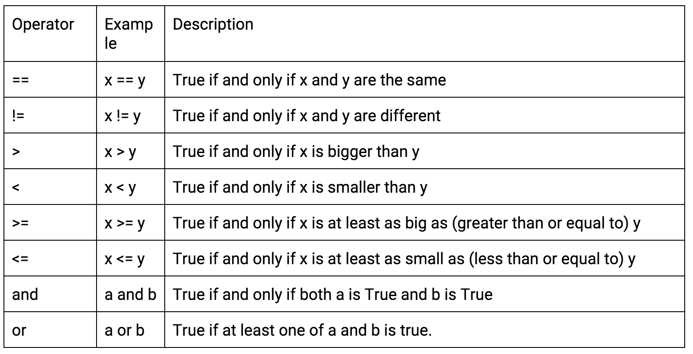

# Python Conditional Statements
Often, we only want code to be executed if a certain condition is met. Just like in JavaScript, we can use conditional statements to help control the flow of our program.

## Objectives:
+ Understand Conditional Statement Syntax
+ Understand When to Use Each Statement Type
+ Evaluate Boolean Expressions

##Multiline Code in Python
The easiest way to follow along with these multi-line Python examples is by creating a new .py file and running your script through the command line.
```
touch conditionals.py
open conditionals.py -a "Atom"
python conditionals.py
```

Alternatively, you can still use the Python console, but for multiline commands, you will need to use tab to indent where appropriate and press enter twice! In the example below you'd type the if statement and press Enter. Then press tab to type the code block, in this case the `print` statement. After typing the code block, hit enter. Finally, you'll need to hit enter again after the second set of ellipses.
```
>>> number_of_lines = 2
>>>if number_of_lines > 1: 
... print "you have to use tab and press enter twice"
... 
```
## If Statements
Conditional statements are a type of control flow: They can control which parts of code get executed, and which do not. The basic conditional statement is the if statement:
```
if condition_1:
    run this block of code
```

Note the syntax here, the condition ends with a colon and  the block of code is indented.
Let's use an example where we ask the use for their favorite animal. In Python this can be achieved using the input() function in Python versions of 3.x or the raw_input function in lower Python versions.

```
yourAnimal = input('What is your favorite animal? ')
myAnimal = "dog"

if yourAnimal == myAnimal:
  print "That's my favorite animal, too!"
```
###The Comparison Operator

Just like in JavaScript, a single equal sign and double sign mean two different things.
  + "==" means "are these two things equal?".
  + "=", means assignment - you're setting a variable equal to a value.

When we check equality use the double equal sign.

### Boolean Values
Python has Boolean values as well: False and True. Booleans can be assigned to variables.
For example:
```
x = (3 == 5)
print x
```
First, we calculate (3 == 5). This is a question: "Is 3 equal to 5?". The answer to that question is False: 3 is not equal to 5.

So, when we say x = (3==5), this is equivalent to x = False. We're setting X to the boolean value False. Now, when we print x, we just print out False.

Here are some important boolean operators:


## If/Else Conditional Statement
There are a few other conditional statements that work together with if. For example, you often want to do something if the condition failed:
```
yourAnimal = input('What is your favorite animal? ')
myAnimal = "dog"
if yourAnimal == myAnimal:
  print "That's my favorite animal, too!"
else:
  print "I don't think you understand how cool dogs are."
```
An "else" clause will always follow an "if" clause, because "else" means "otherwise."

## Statements Using the Elif Clause
Where JavaScript has "else if", Python has "elif". This allow multiple conditions to be checked. WHen a condition is met, the code block underneath it is executed and the conditional statement is exited.
```
if x > 500:
  print "x is really big"
elif x > 50:
  print "x is sort of big"
elif x > 0:
  print "x is not very big!"
else:
  print "x is negative"
```

## Conclusion
Flow Control is an important part of any programming language and Python is no exception. As you practice writing conditional statements in Python, be careful about your syntax because syntax in each language is generally different. However, the general concepts are the same and you can use your insights from JavaScript conditional statements to help work though the next lab.

Some criteria to help decide which condition to use:
+ If - one condition, specifies what to do if condition is True
+ If/Else - one condition, specifies what to do if condition is True OR False
+ Elif - more than one condition
